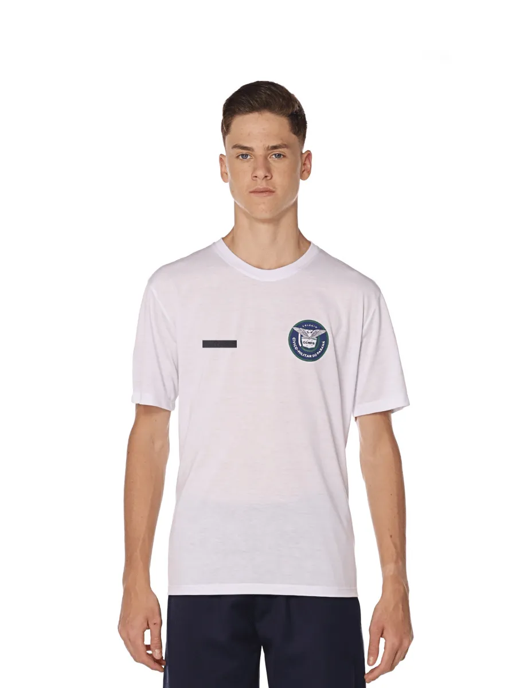
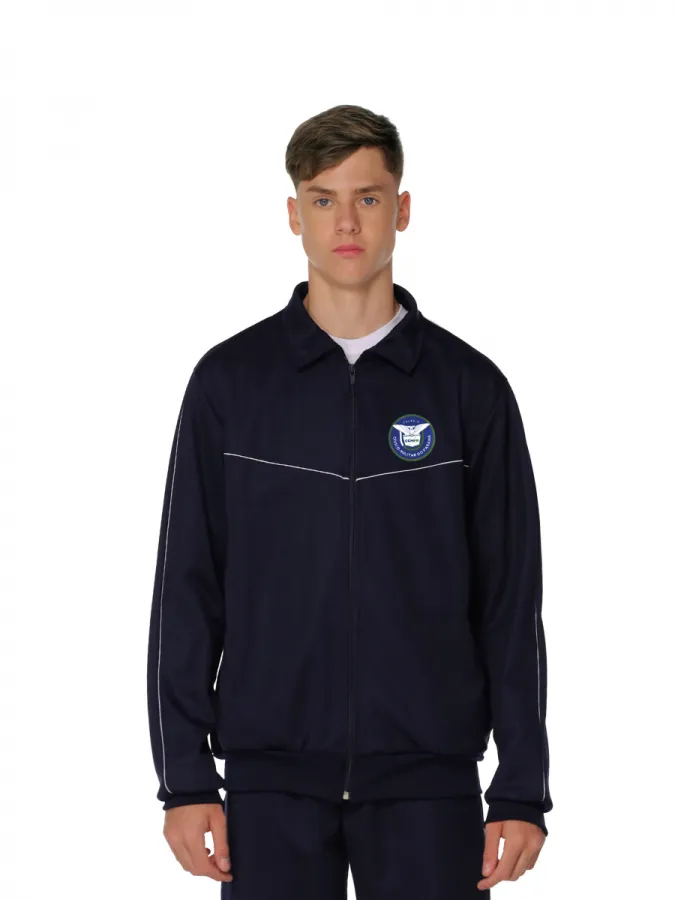
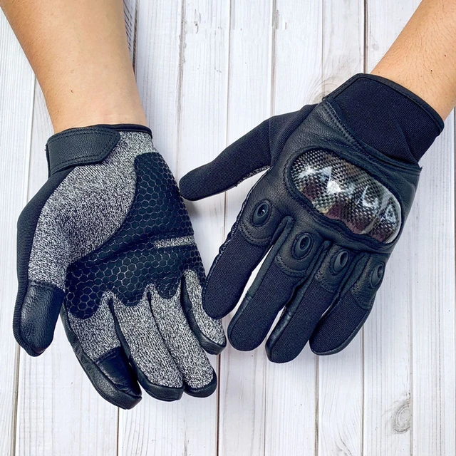

<!DOCTYPE html>
<html lang="pt-br">
<head>
    <meta charset="UTF-8">
    <meta name="viewport" content="width=device-width, initial-scale=1.0">
    <title> Venda de Uniformes Escolares </title>
    <link rel="stylesheet" href="styles.css">
</head>
<body>
    <header>
        

            <h1>Uniformes Escolares</h1>
            <nav>
                <ul>
                    <li><a href="#">Home</a></li>
                    <li><a href="#">Produtos</a></li>
                    <li><a href="#">Sobre</a></li>
                    <li><a href="#">Contato</a></li>
                </ul>
            </nav>
        

    </header>
            <h2>Produtos em Destaque</h2>
            

                
                <h3>Uniforme Escolar Azul</h3>
                
R$ 99,99

            

            

                
                <h3>Uniforme Escolar Preto</h3>
                
R$ 109,99

            

            

                
                <h3>Uniforme Escolar Cinza</h3>
                
R$ 89,99

            

            

                
                <h3>Uniforme Escolar Branco</h3>
                
R$ 119,99

            

            

                
                <h3>Uniforme Escolar Vermelho</h3>
                
R$ 79,99

            

        </section>

        <section class="sobre">
        
